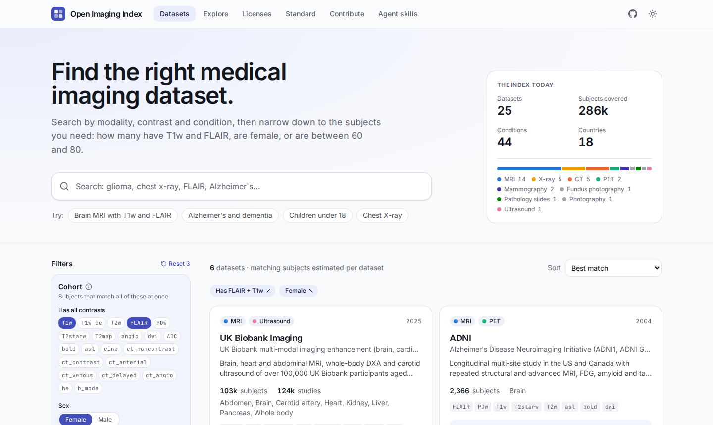
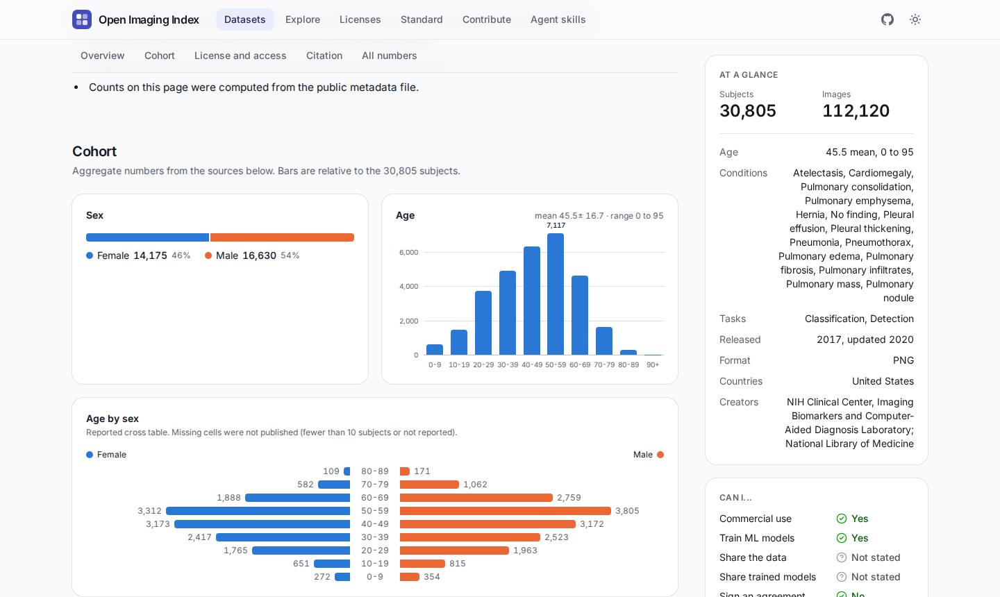
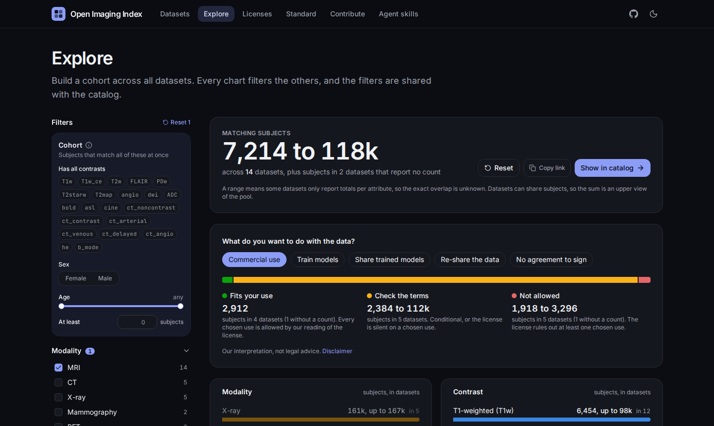

<div align="center">

# Open Imaging Index

**Find the right medical imaging dataset.**<br>
Search by modality, contrast, condition and cohort, see how many subjects match, and check what each license allows.

[**Open the index**](https://spenhouet.com/open-imaging-index/) ·
[Add a dataset](https://spenhouet.com/open-imaging-index/contribute/) ·
[Agent skills](https://spenhouet.com/open-imaging-index/skills/) ·
[catalog.json](https://spenhouet.com/open-imaging-index/catalog.json)

[](https://github.com/Spenhouet/open-imaging-index/actions/workflows/ci.yml)
[](https://github.com/Spenhouet/open-imaging-index/actions/workflows/deploy.yml)
[](LICENSE)
[](LICENSE-DATA)

<a href="https://spenhouet.com/open-imaging-index/?contrasts=FLAIR,T1w&sex=female"></a>

</div>

## Why

Finding a medical imaging dataset usually means reading papers, websites and data use agreements one by one. Lists of links exist, but they rarely say how many subjects have the scans you need, or whether you may train a commercial model on the data. The Open Imaging Index collects that in one searchable place:

- **Cohort numbers, not just links.** Subjects per contrast, sex, age bin, condition, scanner and country, each with its source and the table or page it comes from. Aggregates only, never data about individual subjects.
- **Questions across datasets.** "At least 500 subjects with T1w and FLAIR, aged 60 to 80" is answered per dataset, exactly where the dataset reports the combination and as a range otherwise.
- **Licenses broken into rules.** Every license, from CC BY to custom data use agreements, answers the same 17 questions (commercial use, model training, sharing data or trained models, agreements, ethics approval, ...), each backed by a quote.
- **Open data.** Everything is plain files in this repository, checked in CI and published as CC0 [catalog.json](https://spenhouet.com/open-imaging-index/catalog.json).

<table>
  <tr>
    <td width="50%"><a href="https://spenhouet.com/open-imaging-index/datasets/nih-chestxray14/"></a><br><sub>Dataset pages: cohort charts, every number with its source, the license rule by rule.</sub></td>
    <td width="50%"><a href="https://spenhouet.com/open-imaging-index/explore/"></a><br><sub>Explore: build a cohort across datasets. Every chart filters the others.</sub></td>
  </tr>
</table>

## Use it with an AI agent

Two [agent skills](https://spenhouet.com/open-imaging-index/skills/) ship with this repository: **find-imaging-datasets** turns a request into a verified shortlist, and **contribute-imaging-dataset** adds or corrects an entry as a pull request under strict sourcing rules.

Claude Code:

```text
/plugin marketplace add Spenhouet/open-imaging-index
/plugin install open-imaging-index@open-imaging-index
```

Codex, Cursor, Gemini CLI, GitHub Copilot, Windsurf and other agents that read `SKILL.md`:

```sh
npx skills add Spenhouet/open-imaging-index
```

Claude app: download a skill zip from the [skills page](https://spenhouet.com/open-imaging-index/skills/) and upload it under Customize › Skills.

Agents without skills can read [llms.txt](https://spenhouet.com/open-imaging-index/llms.txt) and [catalog.json](https://spenhouet.com/open-imaging-index/catalog.json).

## Contribute

The index grows with every dataset someone adds. Pick the route that fits:

1. **Suggest a dataset.** Open the [suggestion form](https://github.com/Spenhouet/open-imaging-index/issues/new?template=suggest-dataset.yml) with a link. Someone else writes the entry.
2. **Let an agent do it.** Install the skills above and ask, for example, "Add BraTS 2023 to the Open Imaging Index". The skill verifies every fact online, runs the validator and opens a pull request.
3. **Write it yourself.** Each dataset is three files in one folder:

```text
datasets/brats-2021/
  dataset.yaml   what the dataset is, where to get it, which licenses apply
  README.md      the description, in your own words
  stats.csv      one number per row, with its source and where in the source
```

```sh
bun install
bun run new-dataset my-dataset-2024   # copies datasets/_template
bun run lookup "glioma" mondo         # ontology ids for new vocabulary terms
bun run validate                      # the same checks CI runs
bun run dev                           # preview the site
```

The [data standard](docs/standard.md) defines every field, and the [contribution guide](docs/contributing.md) lists what reviewers check. In short: every number comes from a public source and names it, nothing is computed from data behind an agreement, and license answers quote the license text.

## How it is built

| Part                                                                  | Where                                                                                                                                       |
| --------------------------------------------------------------------- | ------------------------------------------------------------------------------------------------------------------------------------------- |
| Dataset entries                                                       | [`datasets/`](datasets)                                                                                                                     |
| License breakdowns                                                    | [`licenses/`](licenses), answering the questions in [`vocab/license-rules.yaml`](vocab/license-rules.yaml)                                  |
| Vocabularies, mapped to DICOM, BIDS, UBERON, MONDO, HPO and GA4GH DUO | [`vocab/`](vocab)                                                                                                                           |
| Schemas and validator                                                 | [`src/lib/catalog/`](src/lib/catalog), JSON Schemas in [`schema/`](schema) for editor autocompletion                                        |
| Site                                                                  | SvelteKit 3 with adapter-static, Svelte 5, Tailwind 4, shadcn-svelte, MiniSearch, deployed to GitHub Pages                                  |
| Agent skills                                                          | [`plugins/open-imaging-index/`](plugins/open-imaging-index), listed by [`.claude-plugin/marketplace.json`](.claude-plugin/marketplace.json) |

### Development

Requires [Bun](https://bun.sh) and Node 22 or newer on `PATH` (SvelteKit 3 runs its build in Node).

| Command                |                                                                       |
| ---------------------- | --------------------------------------------------------------------- |
| `bun run dev`          | Dev server                                                            |
| `bun run build`        | Static site in `build/`                                               |
| `bun run validate`     | Check all data files                                                  |
| `bun run check`        | Type check                                                            |
| `bun run lint`         | Prettier                                                              |
| `bunx vitest --run`    | Unit tests                                                            |
| `bunx playwright test` | End-to-end tests against the built site                               |
| `bun run schema`       | Regenerate `schema/*.json` after changing `src/lib/catalog/schema.ts` |

## License

- **Code:** [MIT](LICENSE). Covers everything outside the data directories, including the agent skills in `plugins/`.
- **Data:** [CC0 1.0](LICENSE-DATA). Covers `datasets/`, `licenses/`, `vocab/` and `docs/`. Quotes from license texts (the `quote` fields in `licenses/`) and dataset citations (the `citation` fields in `datasets/`) belong to their authors and are not covered by CC0.

The license summaries help with finding and comparing datasets. They are not legal advice: the license or agreement of each dataset is what counts.

## Citation

If the index helps your work, cite it with the metadata in [CITATION.cff](CITATION.cff) (GitHub's "Cite this repository" button).
